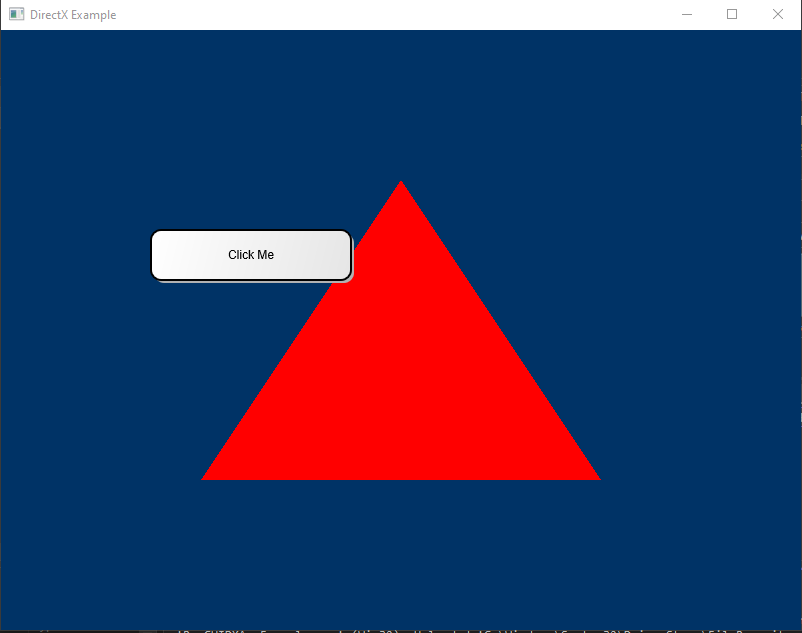
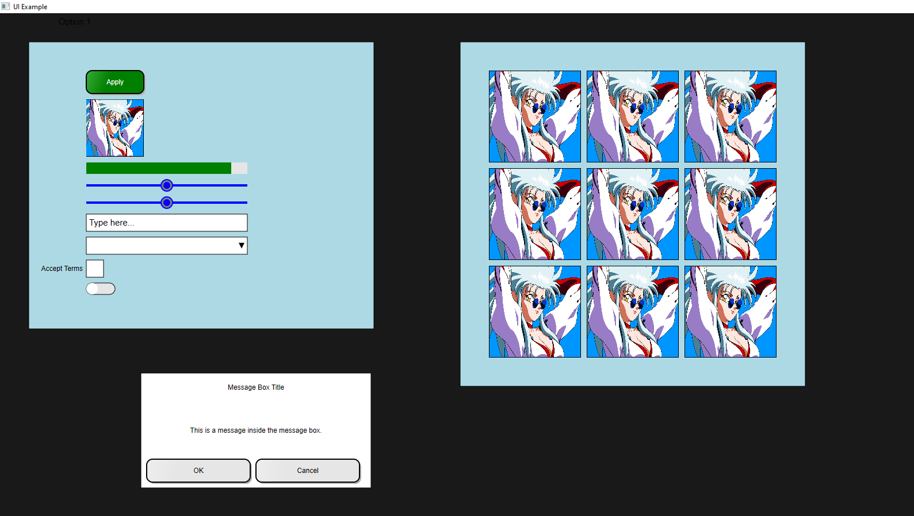

# RanGUI

This is a simple windows only GUI framework built using Direct2D, designed to provide an easy-to-use UI for games. 

## Features

- Easy to use UI components
- Various easy to use controls: Buttons, Labels, Panel, Sliders, TextBoxes, ComboBoxes, CheckBoxes, ToggleSwitches...
- Layout for organizing controls: VerticalLayout, HorizontalLayout, GridLayout, and TableLayout
- Event handling system

## Example

Check the example in the `example` directory.

| Example | Description |
| --- | --- |
|  | [Simple UI](example/dx_app/dx_app.cpp) |
|  | [Complex UI](example/simple/simple.cpp) | 

## Requirements

- Windows
- CMake 3.0 or higher
- I just tested with MSVC with C++17 support

## Installation

### Using CMake

```cmake
cmake_minimum_required(VERSION 3.0)
project(my-game)

include(FetchContent)

set(CMAKE_CXX_STANDARD 11)
set(CMAKE_CXX_STANDARD_REQUIRED ON)

FetchContent_Declare(
  RanGUI
  GIT_REPOSITORY https://github.com/ran-j/ran-gui
  GIT_TAG main
  GIT_PROGRESS TRUE
)
FetchContent_MakeAvailable(RanGUI)

add_executable(my-game main.cpp)
target_link_libraries(my-game PRIVATE RanGUI)
```

## Using repository

```bash
git clone
cd ran-gui

mkdir build

cd build
cmake ..
cmake --build .

# link RanGUI.lib to your project
```
